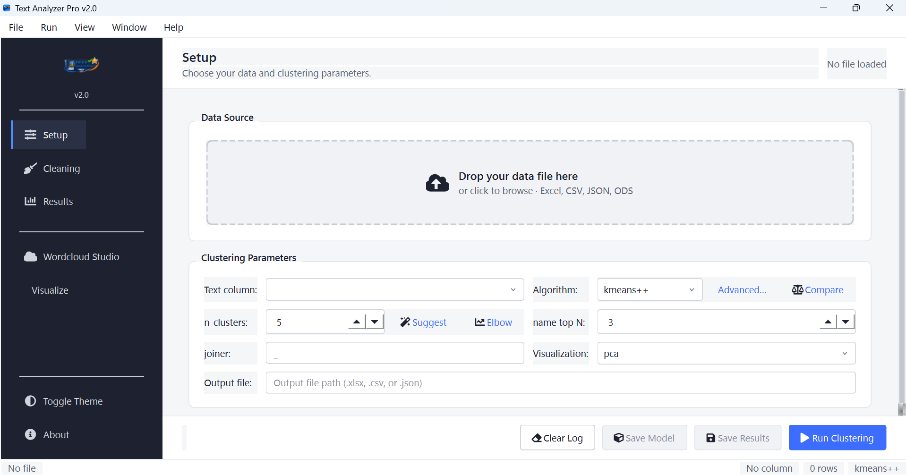

# Text Analyzer Pro

[]() []() []() [](LICENSE)

Python desktop app for **text clustering and word-cloud analysis** of Excel, CSV, JSON, and ODS files using **TF-IDF**, **KMeans (k-means++)**, **HDBSCAN**, **DBSCAN**, **Agglomerative**, and a polished **Wordcloud Studio**.

Use it for customer-feedback clustering, survey-response analysis, support-ticket triage, ServiceNow / Jira ticket grouping, and general NLP exploration on tabular data — entirely on your machine, no cloud upload.

---



---

## Why this project

- Works directly with **every Excel variant** (`.xlsx`, `.xlsm`, `.xltx`, `.xltm`, `.xls`, `.xlsb`), **OpenDocument** (`.ods`), **CSV**, and **JSON**
- Handles real-world non-UTF-8 CSVs (cp1252 Excel exports) without forcing a re-save
- Non-technical-friendly desktop GUI built with PySide6 — drag-and-drop file load, dark/light theme, live wordcloud preview
- **Suggest K** (silhouette) and **Elbow** buttons remove the guesswork from `n_clusters`
- **Compare Algorithms** runs KMeans + DBSCAN + Agglomerative side-by-side and picks the best by silhouette
- **Advanced TF-IDF** dialog exposes `min_df` / `max_df` / n-grams / hashing for power users
- **Save Model** + **Load Model** lets you train once and apply the same clustering to fresh batches
- **Lemmatize words (NLTK)** option for normalizing inflections before vectorization
- Optional CLI for headless / scripted runs

---

## Features

### Data input
- All Excel formats — `.xlsx`, `.xlsm`, `.xltx`, `.xltm`, `.xls`, `.xlsb` — plus `.ods`, `.csv`, `.json`
- Encoding fallback for CSV/JSON: tries UTF-8, UTF-8-with-BOM, cp1252, then latin-1; warns once when a non-UTF-8 source is auto-detected
- Multi-sheet Excel support; sheet picker auto-hides for single-sheet sources
- 5-row preview table and column-type chips appear inline when a file loads

### Cleaning recipe
- Toggleable: trim whitespace, lowercase, collapse whitespace, remove punctuation / numbers / URLs / emails, drop duplicate cleaned rows, **lemmatize words (NLTK)**
- Custom regex find/replace for project-specific cleanups
- Save and reuse cleaning recipes across sessions
- Live preview of cleaning effects before clustering

### Clustering
- Algorithms: **kmeans++** (default), **hdbscan**, **agglomerative**, **dbscan**
- Auto-switch to **MiniBatchKMeans** at 10k+ rows for memory-bounded runs
- Optional **GPU acceleration** via cuML when installed (silent CPU fallback otherwise)
- **Suggest K** finds the best `n_clusters` via silhouette analysis with a confidence band
- **Elbow** finds the best `n_clusters` via inertia-bend detection
- **Compare Algorithms** runs all three CPU algorithms and reports silhouette / Calinski-Harabasz / Davies-Bouldin metrics + runtime
- **Advanced TF-IDF**: `max_features`, `min_df`, `max_df`, `ngram_range` (uni / bi / tri), `HashingVectorizer` for huge corpora
- Auto keyword extraction and human-readable cluster naming
- 2D cluster visualization with PCA or t-SNE

### Wordcloud Studio
- **Live preview** with debounced regen — change a setting, see the cloud refresh
- **Column selector** in the sidebar — switch text columns without leaving the dialog
- **Contrast-aware gradient sampler** — words never disappear into the background, even on white/black/transparent
- 10 mask shapes (circle, heart, star, cloud, hexagon, triangle, diamond, …) plus custom-image masks
- Robust **Copy to Clipboard** (PNG-encoded; pastes cleanly into PowerPoint, Word, etc.)
- Save as PNG, JPG, or SVG
- Per-word stopword editing via right-click

### Model lifecycle
- **Save Model** — bundles the trained model + vectorizer + cluster names into a single `.joblib`
- **Load Model** — applies a saved model to fresh data; non-KMeans algorithms get an auto-built `ApplicableModel` wrapper that uses nearest-neighbor lookup for `predict()`
- All saved artifacts persist top-keyword summaries for cluster naming

### Performance
- Lazy imports of matplotlib / seaborn / NLTK — ~1 second faster cold start
- Centralized `_to_dense` helper for sparse-matrix densification (one-place tuning point)
- Worker threads for clustering + embedding + wordcloud rendering — UI never blocks

---

## Quickstart

### Windows (recommended)

1. Double-click `run.bat` in the project root.
2. On first run it creates `.venv`, installs `requirements.txt`, and launches the GUI.

Manual launch:

```powershell
cd path\to\Text-Analyzer-Pro
.venv\Scripts\Activate.ps1
.venv\Scripts\python.exe gui.py
```

### macOS / Linux

```bash
python3 -m venv .venv
source .venv/bin/activate
pip install -r requirements.txt
python gui.py
```

> **Optional**: `pip install hdbscan` enables the HDBSCAN algorithm. `pip install cuml` (Linux + NVIDIA GPU) enables GPU-accelerated KMeans.

---

## GUI workflow

1. Drag a file onto the **Setup** tab dropzone (or click *Select File…*).
2. Pick the **Text column** — the preview table highlights it in bold.
3. (Optional) Click **Suggest** or **Elbow** to recommend `n_clusters`.
4. (Optional) Click **Compare** to run all algorithms and pick the best by silhouette.
5. (Optional) Click **Advanced…** to tune TF-IDF parameters.
6. Switch to **Cleaning** tab — toggle filters, optionally enable **Lemmatize words (NLTK)**, save the recipe for next time.
7. Click **Run Clustering**.
8. On the **Results** tab, edit suggested cluster names and click **Save Results**.
9. Click **Save Model** to persist the trained pipeline; **Load Model** later applies it to new data.
10. Open **Wordcloud Studio** for live, interactive word-cloud generation per column.

---

## CLI usage

```bash
# KMeans (with kmeans++ init by default; auto-switches to MiniBatchKMeans at 10k+ rows)
python cluster_tool.py -i data.xlsx -c comments -a kmeans -k 5 -o clustered.xlsx

# HDBSCAN — auto-detects cluster count, no -k required
python cluster_tool.py -i data.csv -c comments -a hdbscan --min_cluster_size 8

# DBSCAN — eps + min_samples are exposed (CLI only; GUI nudges users toward HDBSCAN)
python cluster_tool.py -i data.xlsx -c comments -a dbscan --eps 0.4 --min_samples 3

# Memory-efficient TF-IDF for huge corpora
python cluster_tool.py -i big.csv -c text -a kmeans -k 10 --use_hashing --chunk_size 20000

# Save the model
python cluster_tool.py -i data.xlsx -c comments -a kmeans -k 5 \
    --save_model --model_path my_model.joblib

# Apply a saved model to new data
python cluster_tool.py -i fresh_data.xlsx -c comments \
    --load_model --model_path my_model.joblib

# Visualize clusters as PCA / t-SNE PNG
python cluster_tool.py -i data.csv -c text -a kmeans -k 5 --visualize --vis_method tsne

# GPU-accelerated KMeans (requires cuML)
python cluster_tool.py -i data.xlsx -c comments -a kmeans -k 5 --use_gpu
```

Every CLI flag: `python cluster_tool.py --help`. Full usage notes: `docs/usage.md`.

---

## Project layout

```
Text-Analyzer-Pro/
├── gui.py                      # Desktop app entry point
├── cluster_tool.py             # CLI shim → textanalyzer.engine.cluster
├── wordcloud_tool.py           # Compat shim → textanalyzer.engine.wordcloud
├── app_settings.py             # Compat shim → textanalyzer.settings
│
├── textanalyzer/               # Modular package
│   ├── engine/
│   │   ├── cluster.py          # Clustering engine + CLI (canonical home)
│   │   └── wordcloud.py        # Wordcloud rendering / export engine
│   ├── settings.py             # User-settings persistence
│   ├── controllers/            # Glue between view and services
│   ├── models/                 # CleaningConfigModel, AnalysisSession
│   ├── services/               # IOService, AnalysisService
│   ├── ui/                     # Dialogs, widgets, dropzone, sidebar
│   └── workers/                # Background QThread workers
│
├── theme/                      # Tokens-driven QSS for light + dark
├── tests/                      # 106 pytest tests (offscreen Qt)
├── test_cluster_tool.py        # Legacy unittest tests (10)
└── test_wordcloud_tool.py      # Legacy unittest tests (—)
```

The root-level `cluster_tool.py` / `wordcloud_tool.py` / `app_settings.py` are now thin compatibility shims (~10 lines each) that swap themselves out for the canonical modules under `textanalyzer/`. External scripts using `from cluster_tool import ...` continue to work unchanged.

---

## Running the tests

```powershell
# Windows
$env:QT_QPA_PLATFORM = 'offscreen'
python -m pytest tests/ test_wordcloud_tool.py test_cluster_tool.py -q
```

```bash
# macOS / Linux
QT_QPA_PLATFORM=offscreen python -m pytest tests/ test_wordcloud_tool.py test_cluster_tool.py -q
```

Currently **116 tests** pass in ~10 seconds.

---

## Contributing

Contributions are welcome. Start with:

- `CONTRIBUTING.md`
- `.github/ISSUE_TEMPLATE/feature_request.yml`
- `.github/ISSUE_TEMPLATE/bug_report.yml`
- `CHANGELOG.md`

## Security

To report vulnerabilities, see `SECURITY.md`.

## Support

- Website: https://aneekhait.github.io
- GitHub Sponsors: https://github.com/sponsors/AneekHait
- Buy Me a Coffee: https://www.buymeacoffee.com/aneekhait
- LinkedIn: https://www.linkedin.com/in/aneekhait/

If this tool saved you time, details on funded feature requests are in `FUNDING.md`.

## License

MIT license. See `LICENSE`.
