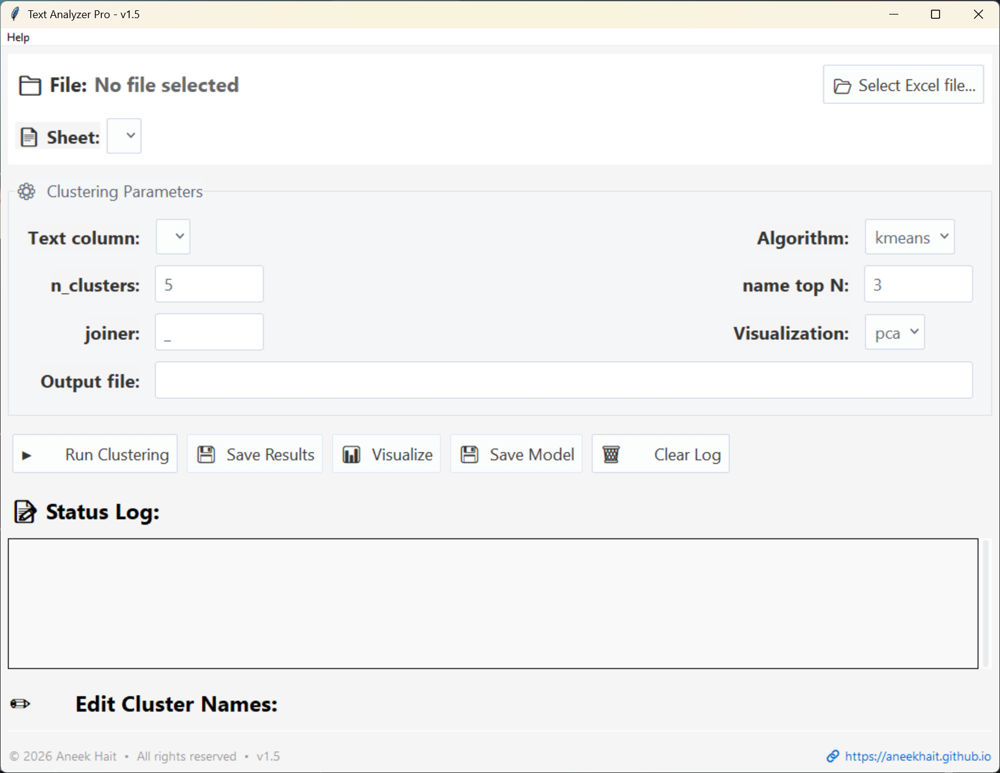

# Text Clustering Tool (Text Analyzer Pro)

Python desktop GUI for **text clustering from Excel, CSV, and JSON files** using **TF-IDF**, **KMeans**, **DBSCAN**, and **Agglomerative Clustering**.

Use this project for customer feedback clustering, survey response analysis, support ticket grouping, and general NLP text analysis on tabular data.

## Why this project

- Works directly with Excel workbooks (`.xlsx`, `.xls`), CSV, and JSON tabular data
- Non-technical friendly desktop GUI built with PySide6
- Auto keyword extraction and human-readable cluster naming
- 2D cluster visualization with PCA or t-SNE
- Advanced column-based wordcloud builder with preview and export
- Optional CLI for scripting and repeatable workflows

## Features

- Excel multi-sheet support plus CSV/JSON table loading
- Text preprocessing and TF-IDF vectorization
- Clustering algorithms: `kmeans`, `dbscan`, `agglomerative`
- Cluster keyword extraction and suggested cluster names
- Visualizations: PCA and t-SNE
- Wordcloud builder with n-grams, stopword controls, top-term stats, PNG export, and term-table export
- Save clustered output back to Excel, CSV, or JSON
- Persist models with `joblib`

## Quickstart

### Windows (recommended)

1. Double-click `run.bat` in the project root.
2. On first run it creates `.venv`, installs `requirements.txt`, and launches the GUI.

Manual launch:

```powershell
cd path\to\text-clustering-tool
.venv\Scripts\Activate.ps1
.venv\Scripts\python.exe gui.py
```

### macOS / Linux

```bash
python3 -m venv .venv
source .venv/bin/activate
pip install -r requirements.txt
python gui.py
```

## GUI usage

1. Click **Select File...**
2. Choose the sheet or table and text column
3. Select algorithm + parameters
4. Click **Run Clustering**
5. Edit suggested names (optional), then click **Save Results**
6. Click **Generate Wordcloud** any time after loading a sheet to open the dedicated preview/export builder for the selected column



Screenshot: the primary interface lets you pick files, tweak clustering parameters, run analysis, and monitor the status log.

## CLI usage

```bash
# KMeans
python cluster_tool.py -i data.xlsx -c comments -a kmeans -k 5 -o data_clustered.xlsx

# DBSCAN
python cluster_tool.py -i data.xlsx -c comments -a dbscan --eps 0.4 --min_samples 3

# CSV
python cluster_tool.py -i data.csv -c comments -a kmeans -k 5 -o data_clustered.csv
```

More examples: `docs/usage.md`

## Project files

- `gui.py`: PySide6 GUI workflow
- `cluster_tool.py`: clustering engine + CLI
- `wordcloud_tool.py`: wordcloud text processing, rendering, and export helpers
- `run.bat`: one-click Windows launcher
- `docs/usage.md`: detailed usage and notes

## Contributing

Contributions are welcome. Start with:

- `CONTRIBUTING.md`
- `.github/ISSUE_TEMPLATE/feature_request.yml`
- `.github/ISSUE_TEMPLATE/bug_report.yml`
- `CHANGELOG.md`

## Security

To report vulnerabilities, see `SECURITY.md`.

## Support

- Website: https://aneekhait.github.io
- GitHub Sponsors: https://github.com/sponsors/AneekHait
- Buy Me a Coffee: https://www.buymeacoffee.com/aneekhait
- LinkedIn: https://www.linkedin.com/in/aneekhait/

If this tool saved you time, details on funded feature requests are in `FUNDING.md`.

## Growth checklist

For maintainers: `docs/github-growth-checklist.md`

## License

MIT license. See `LICENSE`.
